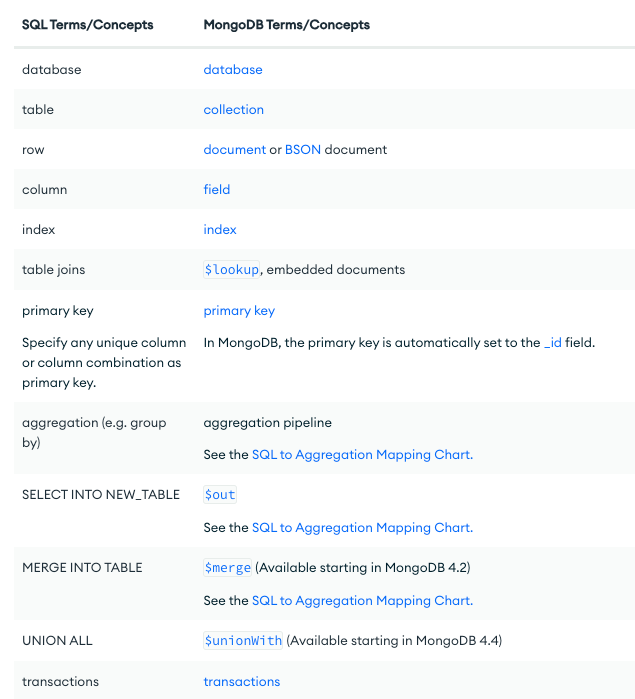

# MongoDB Installation and Shell Commands

To install MongoDB, please refer to the official MongoDB documentation for detailed instructions: [Install MongoDB on macOS](https://www.mongodb.com/docs/manual/tutorial/install-mongodb-on-os-x/)

## Installation Steps

1. Tap the MongoDB Homebrew repository:
   ```
   brew tap mongodb/brew
   ```

2. Update Homebrew:
   ```
   brew update
   ```

3. Install MongoDB Community Edition version 6.0:
   ```
   brew install mongodb-community@6.0
   ```

## MongoDB Service Commands

To manage the MongoDB service, use the following commands:

- Start MongoDB:
  ```
  brew services start mongodb-community@6.0
  ```

- Restart MongoDB:
  ```
  brew services restart mongodb-community@6.0
  ```

- Stop MongoDB:
  ```
  brew services stop mongodb-community@6.0
  ```

## MongoDB Shell Commands

To interact with MongoDB using the MongoDB shell, use the following commands:

- Enter the MongoDB shell:
  ```
  mongosh
  ```

- Enter the MongoDB shell using a specific user:
  ```
  mongosh --port 27017 --authenticationDatabase "<DATABASE_NAME>" -u "USERNAME"
  ```

- Create a user in MongoDB: (Please provide the appropriate command for user creation)

- Load data from a BSON file into MongoDB:
  ```
  mongorestore --username=<USERNAME> --password=<PASSWORD> --authenticationDatabase=<AUTHENTICATION_DATABASE_NAME> -d <INGESTION_DATABASE_NAME> -c <INGESTION_COLLECTION_NAME> <LOCATION_OF_BSON_FILE>
  ```

- Load data from a JSON file into MongoDB:
  ```
  mongoimport --username=<USERNAME> --password=<PASSWORD> --authenticationDatabase=<AUTHENTICATION_DATABASE_NAME> -d <INGESTION_DATABASE_NAME> -c <INGESTION_COLLECTION_NAME> --file=<LOCATION_OF_JSON_FILE>
  ```

## SQL to MongoDB Mapping

Here is a mapping diagram that illustrates the conversion from SQL concepts to MongoDB concepts:



Please note that the diagram provides an overview of the mapping between SQL and MongoDB concepts.